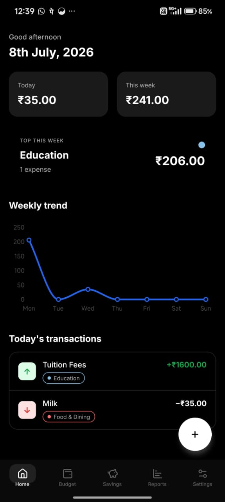
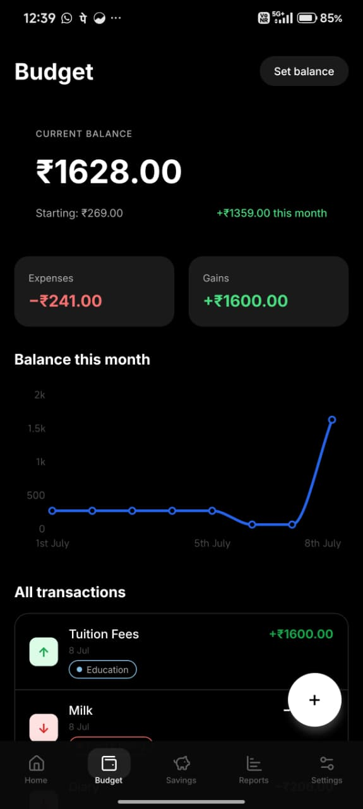
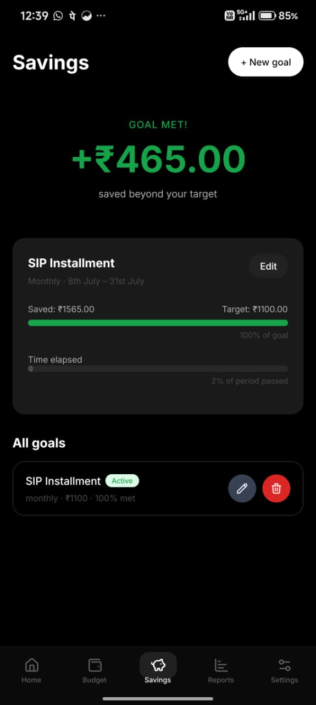
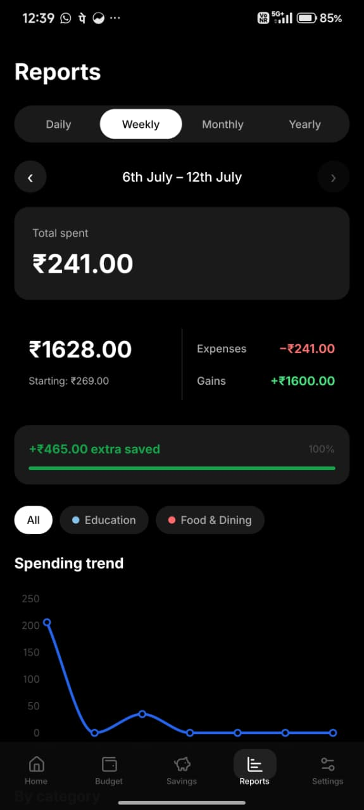
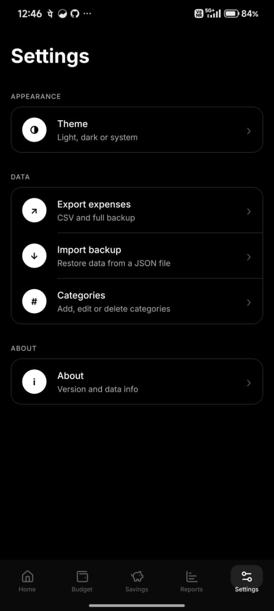
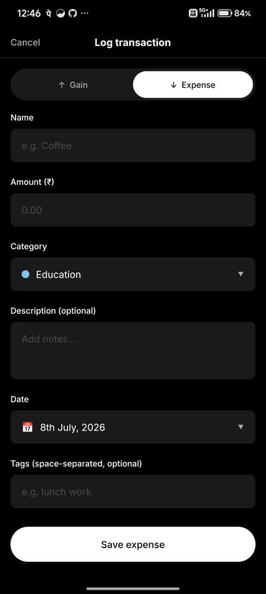

# Expense Tracker

A black-and-white, Uber-inspired expense tracking app built with Expo and Tamagui. Track gains, expenses, set budgets, and visualize your spending — all on-device with SQLite.

## Download

Grab the latest APK from the [Releases](https://github.com/piush/expense-tracker-self/releases) tab.

## Features

- **Log transactions** — gains (↑) and expenses (↓) with categories, tags, and descriptions
- **Budget balance** — set your base balance and track running totals
- **Savings goals** — monthly or annual targets with progress bars
- **Charts & reports** — daily, weekly, monthly, and yearly breakdowns (line, bar, donut)
- **Category manager** — create and manage custom categories
- **CSV export** — export your data with a date range picker
- **Full offline** — all data stored locally via SQLite, no account needed

## Screenshots

|                 Home                 |                 Budget                 |                       Savings                        |
| :----------------------------------: | :------------------------------------: | :--------------------------------------------------: |
|        |      |                  |
|             **Reports**              |              **Settings**              |                 **Add Transaction**                  |
|  |  |  |

## Pages

### Home (`(tabs)/index.tsx`)

Today's overview and weekly summary. Shows your current balance, recent transactions, and a quick-glance weekly breakdown. Tap any transaction to edit, long-press to delete. FAB to add a new transaction.

### Budget (`(tabs)/budget.tsx`)

Set your base balance and track your running total over time. See a line chart of your balance history, plus a full list of all transactions with filters.

### Savings (`(tabs)/savings.tsx`)

Create monthly or annual savings goals with target amounts. Large status text (green on track / red behind) and progress bars show how you're doing against each goal.

### Reports (`(tabs)/reports.tsx`)

Visual breakdowns of your finances — daily, weekly, monthly, and yearly. Line charts for trends, bar charts for comparisons, and donut charts for category distribution.

### Settings (`(tabs)/settings/`)

- **Theme** — toggle between light and dark mode
- **Categories** — add, edit, and delete custom categories (predefined ones are locked)
- **Export** — CSV export with date range picker
- **Import** — restore data from a CSV backup
- **About** — app version and info

## Built with

[Expo](https://expo.dev) · [Tamagui](https://tamagui.dev) · [expo-sqlite](https://docs.expo.dev/versions/latest/sdk/sqlite/) · [react-native-chart-kit](https://github.com/indiespirit/react-native-chart-kit)

## Development

```bash
bun install
bun start
```

Uses file-based routing via `expo-router`. Screens live under `src/app/`.
